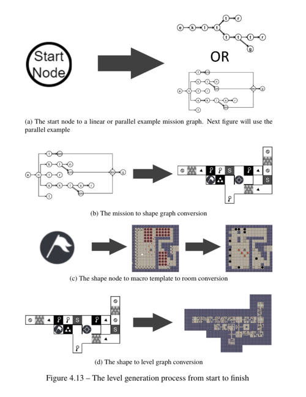

# Mixed-initiative-Tile-based-Designer

The Mixed-initiative Tile-based Designer (MTD) is a declarative modelling implementation aimed at making procedural 2D tile-based level design intuitive and easy for anyone without programming knowledge. Within the constraints of the project, the user will be able to generate, from scratch, 2D tile-based worlds of theoretically any size, both online and offline. The project comes with an example configuration in order to make it as accessible and easily understood as possible.

The output of the MTD generates 2D levels suitable for games such as The Binding of Isaac. Game mechanics need to programmed on top of the generated content, however.

The procedural algorithm is in essence a combination of two systems

1. The mission/space grammar system proposed by Joris Dormans in his paper "Adventures in level design: generating missions and spaces for action adventure games".
2. The Spelunky room template system

## Table of Contents

- [Background](#background)
- [Install](#install)
- [Usage](#usage)
- [Related Efforts](#related-efforts)
- [Maintainers](#maintainers)
- [Contributing](#contributing)
- [Special Thanks](#special-thanks)
- [License](#license)

## Background

Current implementations of procedural generation in level design are often unintuitive and complicated. There is limited maneuverability with procedural algorithms without programming expertise, which leads to a disconnect between algorithm programmers and level designers. The ideal future sports procedural algorithms which can be used by the broader public, facilitate creativity and do not require extensive work to operate. The MTD is an attempt to move towards that future, by offering an off the shelf procedural generator that is highly configurable and fast.

The procedural generation is (informally) described in the following [video](https://www.youtube.com/watch?v=EuGOtGQj0i0). Essentially, however, the algorithm is graph-based and works by substituting itself until there are no more substitutions to make. There are three stages which all work with substitution:

* Generating a mission graph from an initial start mission node
* Generating a shape graph from the mission graph
* Generating a level graph from the shape graph
* Resolving all non-deterministic tiles and blocks of tiles into deterministic tiles

The image below is a summary of the process taken from the master thesis based on this procedural generator.

## Install

This project uses Unity3D. Unity can be downloaded from their [official website](https://unity3d.com/get-unity/download). The MTD uses Unity version 2020.3.16f1 but should work for at least most versions after 2019.

There should be no need for installs apart from Unity. Open the repo with Unity and it should work off the shelf.

## Usage

There are five primary ways of modifying the output of the procedural generator.

1. Adding, modifying or removing mission grammar rules.
2. Adding, modifying or removing shape grammar rules.
3. Adding, modifying or removing macro templates.
4. Adding, modifying or removing micro templates.
5. Adding or removing deterministic or probabilistic tiles.

It is also possible to modify any script components on Unity GameObjects in the various scenes in the project. Some may indeed be necessary to change to reflect changes done to mission rules, etc.

## Related Efforts

- [Designing procedurally generated levels](https://www.aaai.org/ocs/index.php/AIIDE/AIIDE13/paper/viewPaper/7450) - A paper on gameplay grammars inspired by Joris Dormans mission/space grammars.

## Maintainers

[@rafaeldolfe](https://github.com/rafaeldolfe).

## Contributing

Feel free to dive in! [Open an issue](https://github.com/rafaeldolfe/Mixed-initiative-Tile-based-Designer/issues/new) or submit PRs.

## Special Thanks

Special thanks to the creators of Evolutionary Dungeon Designer whose images for the tiles are used for the MTD. José Fernandez has been kind enough to grant permission to open source the images.

## License

[MIT](LICENSE) © Rafael Dolfe
